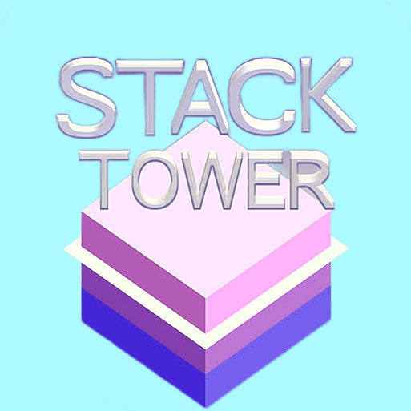

# Stack Tower

Stack Tower is a fun and addictive Android game where your goal is to build the tallest tower possible. Test your timing and precision as you stack blocks on top of each other. Be careful, though, as any misplaced block can lead to a wobbly tower or even its collapse!

## Features

- **Simple and Addictive Gameplay:** Tap the screen to stack blocks on top of each other and build the tower.
- **Challenging Levels:** As you progress, the game becomes more difficult, with faster block movements and additional challenges.
- **Vibrant Graphics:** Enjoy colorful and visually appealing graphics while playing.
- **Offline Play:** Play Stack Tower anytime and anywhere, even without an internet connection.

## Installation

To play Stack Tower on your Android device, follow these steps:

1. Download the APK file from the [Releases](app/Stack-Tower.apk) section.
2. Enable installation from unknown sources in your device settings.
3. Install the APK file on your device.
4. Open the game and start stacking!

## How to Play

1. Launch the Stack Tower app on your Android device.
2. Tap the screen to drop a block on top of the previous one.
3. Aim for perfect alignment to stack the blocks as straight as possible.
4. The tower will move faster as you progress, making it more challenging to stack accurately.
5. If a block is misplaced and overhangs the previous one, it will be cut off, and your tower's height will decrease.
6. The game ends when you lose all the blocks and the tower collapses.

## License

Stack Tower is released under the [MIT License](./LICENSE).

## Warning

Unauthorized use, reproduction, or distribution of this code, in whole or in part, without the explicit permission of the owner, is strictly prohibited and may result in severe legal consequences under the relevant IT Act and other applicable laws.
To use this code, you must first obtain written permission from the owner. For inquiries regarding licensing, collaboration, or any other use of the code, please contact virendratarte22@gmail.com.
Thank you for respecting the intellectual property rights of the owner.
